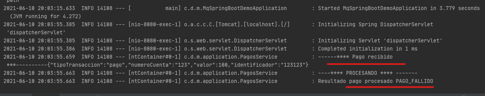

# IBM MQ utilizando Spring Boot

Este repositorio tiene como objetivo mostrar un el desarrollo de un aplicativo MQ JMS utilizando SpringBoot 

### Tecnología Utilizada
- SpringBoot 2.5.1 
- Java 11 
- Librerias java  [mq-jms-spring](https://mvnrepository.com/artifact/com.ibm.mq/mq-jms-spring-boot-starter/2.4.1)

## 1. Iniciando MQ Local
   En esta caso estaremos utilizando la imagen oficial de [IBM MQ](https://hub.docker.com/r/ibmcom/mq) la cual se encuentra en DockerHub
 ```bash 
    docker run --name mq-dev --env LICENSE=accept --env MQ_QMGR_NAME=QM1 --publish 1414:1414 --publish 9443:9443 --detach ibmcom/mq
  ```
  Verifica que la contenedor se esta ejecutando de manera exitosa ingresando a https://localhost:9443/ibmmq/console/login.html
  <br>
  
### 2. Configurando aplicativo
   La configuración por defecto que instala el ibm mq local incluye el usuario "admin" con contraseña "passw0rd" por lo que tendriamos que ingresar esa configuración en nuestro archivo del proyecto application.properties.
   
 ```bash
ibm.mq.queueManager=QM1
ibm.mq.channel=DEV.ADMIN.SVRCONN
ibm.mq.connName=localhost(1414)
ibm.mq.user=admin
ibm.mq.password=passw0rd
```
## 3. Agregando IBM MQ Starter
Puedes encontrar la libreria para springboot en el repositorio de [maven](https://mvnrepository.com/artifact/com.ibm.mq/mq-jms-spring-boot-starter) en este caso estamo utilizando maven por lo tanto la configuración es: 
 ```
  <dependency>
    <groupId>com.ibm.mq</groupId>
    <artifactId>mq-jms-spring-boot-starter</artifactId>
    <version>2.4.1</version>
  </dependency>
```
## 4. Verificando Aplicativo
   <br>
   En este paso tenemos que iniciar una instancia de nuestro aplicativo, luego importamos la colección Postman que se encuentra en el proyecto y realiza a probar se ha dicho!!
   <br>
   <br>
   
   
   Revisa el log del aplicativo
   
   
## 5. Dockerizando
   Deseas contenerizar el aplicativo? Lo que tendrias que hacer es lo siguiente: <br>
   1. Cambiar valor de localhost en la propiedad ibm.mq.connName del application.properties por <br><br> ```ibm.mq.connName=([IPContenedorIBM-MQ-LOCAL])1414```
     <br>
     <br>
     *** La dirección ip del contenedor ibm-mq-local la puedes encontrar ejecutando ```docker inspect [id-contenedor-ibm-mq]``` ***
  3. Agregar archivo dockerFile a la raiz del proyecto
  4. Copiar y pegar esta configuración
```bash
FROM openjdk:11-jre-slim
RUN mkdir /app
COPY target/mq-spring-boot-demo.jar app/mq-spring-boot-demo.jar
EXPOSE 8080
ENTRYPOINT ["java","-jar","app/mq-spring-boot-demo.jar"]
```
4. Ejecutar un ```mvn clean``` y luego un ```mvn package``` para generar compilados y archivos JAR.
5. Ejecutar comando docker build en la raiz del proyecto.
   
  ```bash
   docker build -t demo-spring-boot .
  ```
6. Una vez construida la imagen la ejecutamos realizando el siguiente comando <br><br>``` docker run --name demo-spring-boot -it -p 8080:8080 demo-spring-boot```
   <br>
   <br>
8. Validando ejecución exitosa del contenedor creado.
   <br>
   <br>
   
